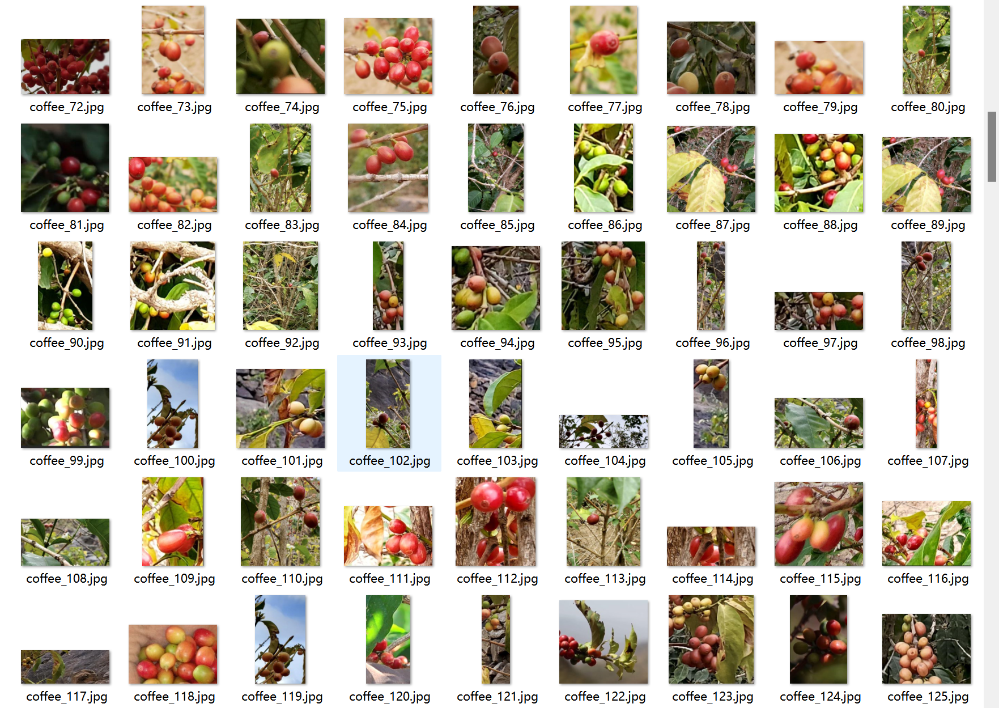

# Coffee Bean Maturity Detection - Target Detection Dataset

Dataset Information Introduction: A total of 511 images and one-to-one corresponding annotation files are included. Annotation files are provided in two formats, including VOC-formatted xml files and YOLO-formatted txt files. The objects to be detected include the following:
- 'Immature'
- 'Mature-Ripe'
- 'Semi_Mature'
- 'Overripe'

Each column has information about the number of images and the number of bounding boxes as follows: (When annotating, English labels are typically used, with Chinese characters provided inside parentheses for reference.)

Note: One image may contain multiple objects, so the total number of bounding boxes may be greater than the total number of images.

The complete dataset consists of three folders and a txt file:
- all_images: Stores the dataset's images, screenshots included.
- all_txt: And classes.txt: Stores the yolo-formatted txt annotation files, in the same quantity as the images, each annotation file corresponding to one image.
- classes.txt:
To understand the standard format of the yolo-formatted files, please search for it on your own. In short, the number 0 represents the name at index 0 in the arrays in classes.txt.
all_xml: The VOC-formatted xml annotation file.
It matches the number of images and each annotation file corresponds to one image.
To understand the standard format of the VOC-formatted files, please search for it on your own.
Images and annotation files in both formats can be used, choose one according to preference.
Annotation effect screenshots included.

## Images

Here is a pay link on Stripe ( https://buy.stripe.com/3cs8yP7sY87d0vu9AB ). Please contact me lonlonago@foxmail.com after funding $89, and I will send you a complete data files , thank you!

